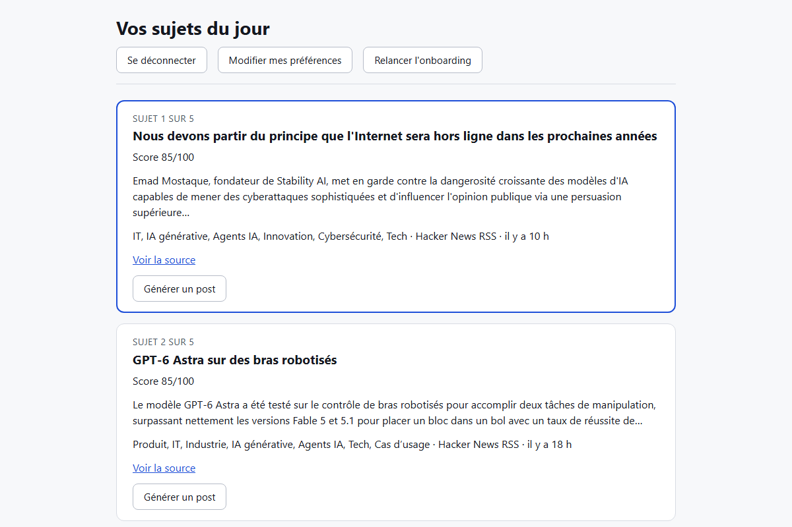

# Reachly

Reachly aide un solopreneur Tech/IA à publier régulièrement sur LinkedIn : moins de temps
passé en veille (jusqu'à 4h/jour aujourd'hui), le bon sujet choisi à temps, un premier jet
de post généré dans sa propre tonalité — jamais publié sans validation humaine explicite.

Pensé pour trois profils partageant la même interface (la sous-segmentation calibre les
réglages par défaut, pas le design) :

- **Léa**, freelance — veut être reconnue comme experte pour gagner des clients.
- **Maxime**, créateur de contenu — veut alimenter sa newsletter sans rater d'info stratégique.
- **Bastien**, salarié tech — veut gagner en visibilité avec un contenu "safe" pour l'entreprise.

## Statut

🚧 **MVP en développement actif** — pas encore déployé publiquement.
Fonctionnel en local : inscription, onboarding, tableau de bord, génération et publication de post.
Prochain jalon : stabilisation (accessibilité, tests) avant un premier déploiement.



## Ce que ça fait aujourd'hui

- Inscription / connexion (sans confirmation par e-mail en V1, quota Supabase oblige).
- Onboarding en 5 étapes : identité, métiers/secteurs, catégories/sources, tonalité et
  voix narrative, LinkedIn/posts déjà publiés — chaque étape relançable individuellement.
- Tableau de bord : top 5 des sujets tech & IA des dernières 24h, scorés et classés,
  sans aucune action de l'utilisateur ; repli visible si aucun sujet ne correspond à ses
  préférences.
- Écran de préférences pour ajuster métiers/secteurs/catégories/tonalité/voix narrative
  sans repasser par tout l'onboarding.
- Génération d'un premier jet de post par sujet, modifiable, à enregistrer ou "publier" —
  aucun appel à l'API LinkedIn : la personne colle et publie elle-même sur LinkedIn.

## Ce qu'on ne fait pas (MVP)

Pas de monétisation, pas de concurrence frontale avec les outils de growth LinkedIn
généralistes (Taplio, Buffer, Hootsuite...), pas de publication automatique, pas de style
de rédaction générique, pas de monitoring d'engagement post-publication, pas de
programmation différée de publication, pas d'écran différent par persona. Détail complet
dans [`docs/cadrage.md`](docs/cadrage.md).

## Stack

React + Vite, Supabase (auth et données), n8n pour la génération de post assistée par IA.

## Démarrer en local

```bash
npm install
cp .env.example .env   # puis renseigner les valeurs (jamais commité)
npm run dev
```

Variables d'environnement (voir [`.env.example`](.env.example)) :

| Variable | Description |
| --- | --- |
| `VITE_SUPABASE_URL` | URL du projet Supabase |
| `VITE_SUPABASE_ANON_KEY` | Clé anonyme Supabase (publique côté client) |
| `VITE_N8N_WEBHOOK_GENERATION_POST` | URL du webhook n8n de génération de post |

Autres commandes :

```bash
npm run build      # build de production
npm run preview    # sert le build localement
```

## Structure du projet

```
src/
  pages/               Écrans (Inscription, Connexion, Dashboard, Preferences)
  pages/onboarding/    Les 5 étapes du tunnel d'onboarding
  components/          Composants partagés (bouton de déconnexion, génération de post)
  lib/                 Client Supabase
docs/
  cadrage.md           Le problème, pour qui, ce qu'on ne fait pas, les décisions — source de vérité
  ticket.md            Gabarit de ticket (jamais rempli directement)
  tickets/             Un fichier par ticket, critères d'acceptation en Gherkin
  journal.md           Une entrée par tour de travail : fait, appris, reste à faire
```

## Méthode de travail

Ce projet suit une méthode écrite dans [`AGENTS.md`](AGENTS.md) : `cadrage → ticket →
direction d'écran → code`, avec validation humaine entre chaque étape. Le fichier écrit
est la source de vérité ; le code en est la sortie. Avant de proposer quoi que ce soit,
`docs/cadrage.md` fait foi.
